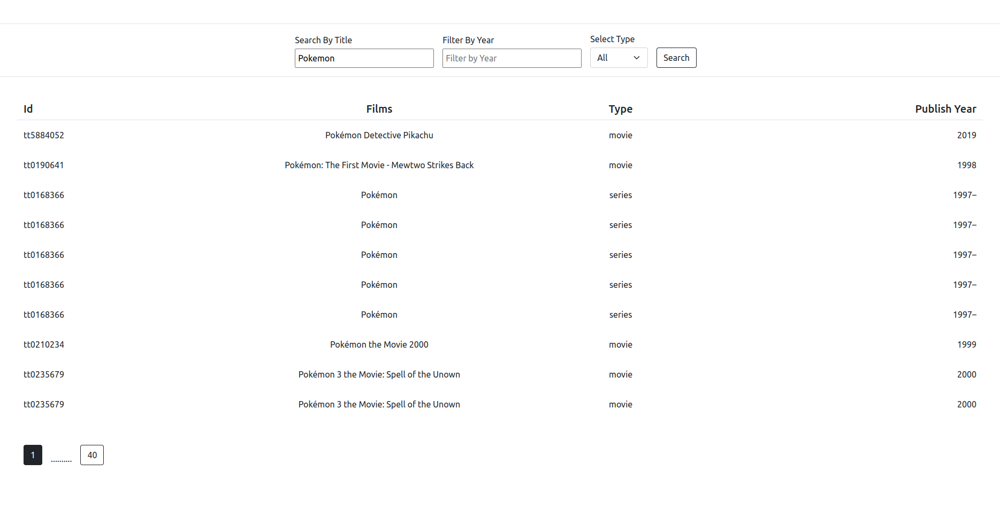
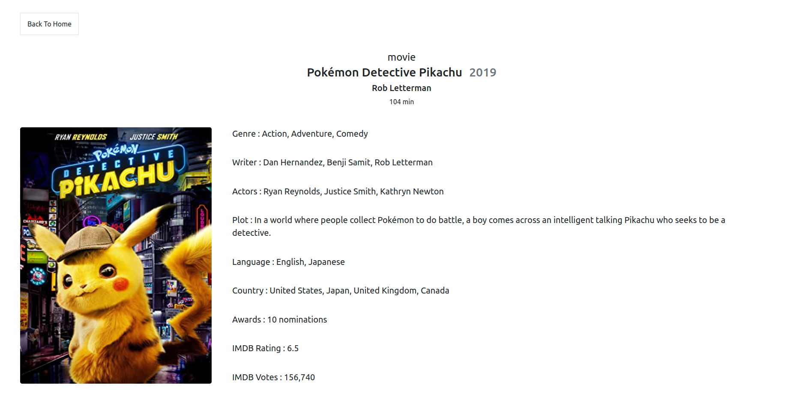
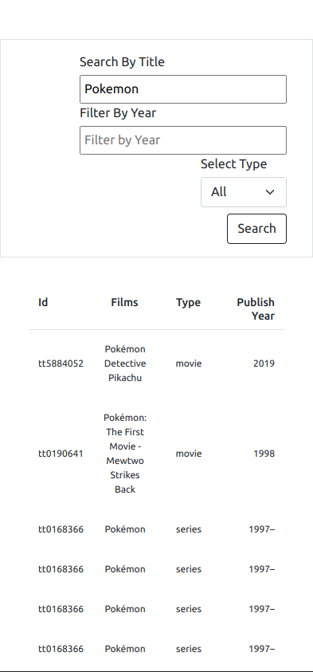
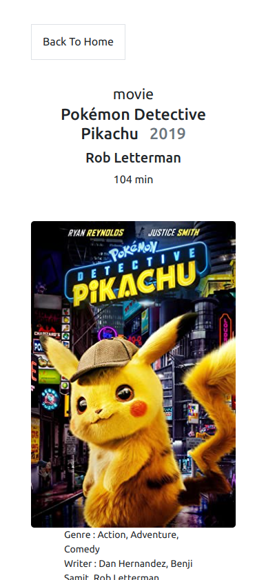

# Movie App

This project crated for **Invent Analytics** .

## Screenshots

Desktop




Mobile




### Run Loacaly

Clone the project

```bash
 git clone https://github.com/batuhanbaybas/Invent-Analytics-case-study.git
```

Go to the project directory

```bash
  cd Invent-Analytics-case-study
```

Install dependencies

```bash
  npm install or yarn install
```

Start the dev server

```bash
  npm run start or yarn start
```

## User Manual

When the app start on home page. On the bottom of the page, you can see the page number if you click one
of them your state change depends on your choice also as same as year and type. When you click on the movie, you
redirect Detail if you want to go back to
home page, you can click on the button in the top left corner.

## Tech Stack

- [Redux-toolkit/react-redux](https://redux.js.org/) - A library for managing state in your React apps.
- [Bootstrap](https://getbootstrap.com/) - A front-end framework for developing responsive, mobile-first projects on the
  web.
- [React-router-Dom](https://reactrouter.com/) - A routing library for React
- [Axios](https://axios-http.com/) - A Promise based HTTP client for the browser and Node.js
- [React-Lottie](https://github.com/chenqingspring/react-lottie) - Make beautiful, animated loading section adapt to
  your app.

